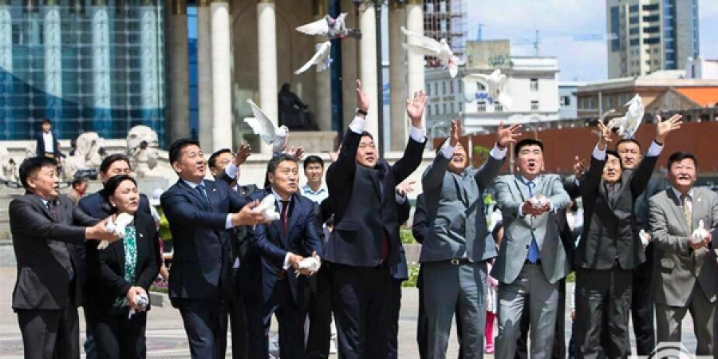
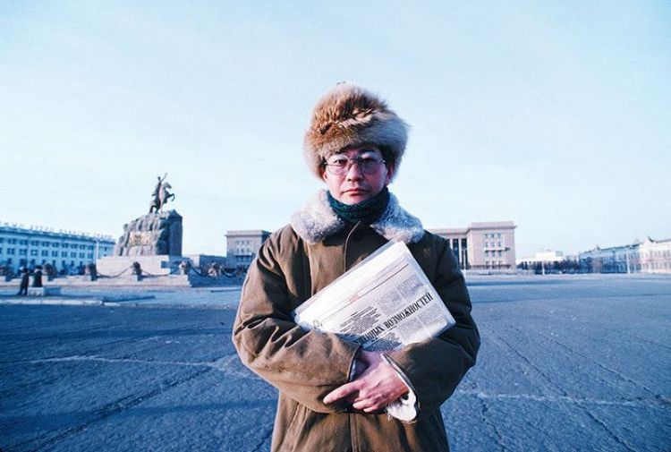
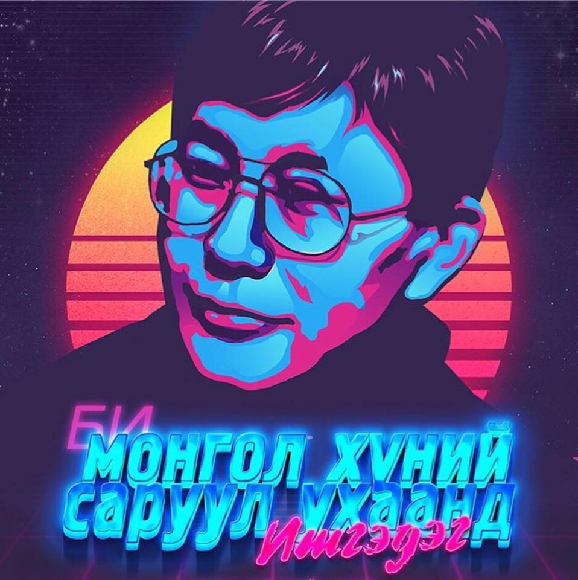
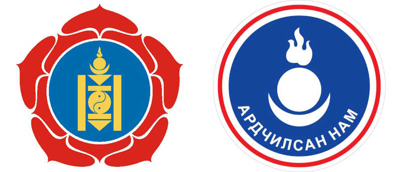
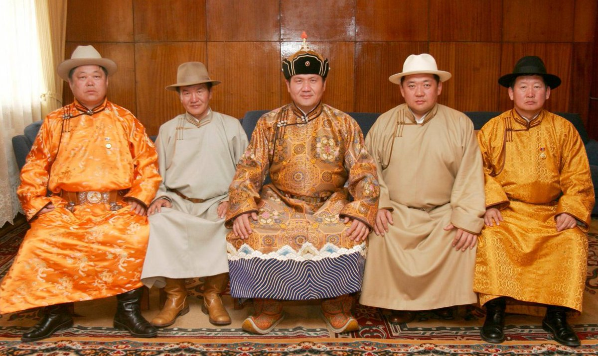
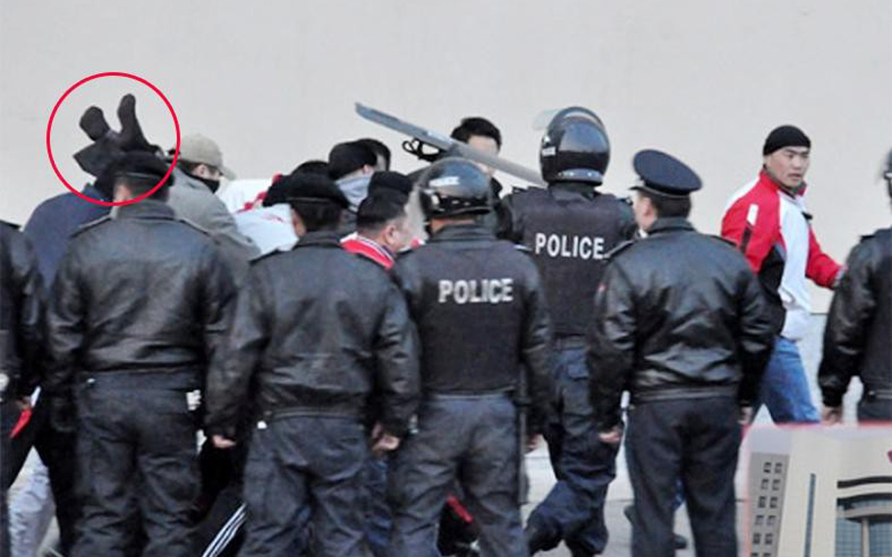
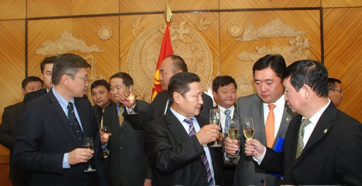

_**From an average guy's perspective**_

_Please note, this series is solely based on my experience as a young man living in Mongolia. If you want to read official and more sophisticated content about Mongolia, please head to the_ [_UB Post_](http://ubpost.mongolnews.mn/)_,_ [_GoGo Mongolia_](http://mongolia.gogo.mn/) _or_ [_MONTSAME._](https://montsame.mn/en/)

The MPP leaders doing a dove release ceremony before the 2016 election. Ironically, it was supposed to symbolize their unity. But only few years later, their party became a chaos.

Weather forecasters were telling it would be the coldest winter since 2000. Though, aside from the cold air blowing through the streets, this winter is certainly becoming the hottest winter in Mongolian political landscape. Every night, in every household, our favorite TV show is airing straight out of the parliament building.

To understand what's really going on below that thin surface of political entertainment, you should know a few major events and concepts that shaped our current "misty" and "smoggy" condition.

* * *

### The assassination of the Zorig Sanjaasuren

_Zorig Sanjaasuren was a leading political figure from the Democratic party. Now, posthumously, he is one of the most respected politicians among young people, due to his tragic death and unstained name._

It was a real shocker to us. We couldn't believe such a thing as an assassination was possible in our peaceful country.

Back then, we only had 2 TV channels; TV Mongolia and the 25th TV (ironic, right?). The government declared statewide mourning for a week and those 2 channels canceled all of their broadcastings. The boredom was so great, it's one of the few memories of my kindergarten years.

As I found out later, it was apparently a political assassination. Still, no one really knows who was the mastermind behind this. But everyone likes to point at some politician and say "_This bastard did it. He hired someone to kill Zorig_".  It's easy to say that, but even the people who charged with his murder are supposedly intimidated by torture or other things to make a false confession. Who knows.

Zorig Sanjaasuren has rare positive image as a politician

>   
> He/She turned into a god
> 
> A popular saying in Mongolia for someone's death. But that _someone_ must've been a not-too-bad person to receive this kind of _compliment_ after his/her death.

As an artist's death boosts his/her record sales, Mr. Sanjaasuren's death made him an icon/hero in Mongolian pop culture.

* * *

### The 2 major political parties: MP(R)P & DP

Fire, sun and moon are the most common symbols in Mongolia

It's ironic to think that the Democratic Party in the US was actually named "Republican Party" at first, same as its now-rival GOP. Similarly, The Mongolian People's Party had a name "Mongolian People's Revolutionary Party" which is now a puppet party of the Nambar.

Our real "grand old party" is MPP and it was the absolute de facto power of the Mongolian politics for 70 years from 1921 (Mongolian People's Revolution) to 1990 (Democratic Revolution). Back then, becoming a party member was an act of honor and had its benefits. But when you get fu\*\*ed up and expelled from it, your life would take a steep downward turn or you would end up on the "gallows" if it were 1930s, when the Stalin's great purges were in motion (more on this later). It became much more gentle when the Khrushchev Thaw began. Though the party still had enough capability to make your life really hard.

Mongolian People's Party is [supposedly](http://www.nam.mn/a/861) a left-wing party with social-democratic ideology and its rival Democratic Party is [supposedly](http://www.demparty.mn/static.php?mid=2&sid=2&id=1) a right-wing party with libertarian ideology. But that kind of ideological difference doesn't matter to them as long as they are capable of hustling taxpayers' money.

At the beginning of the 2000s, the Democratic Party proposed a welfare program called "Children's Money" which was the first nation-wide children's welfare program since the fall of the communist regime. Surprisingly, our social-democratic MPP actually opposed it with a great deal of effort by telling that the DP is trying to turn this nation into a welfare state! (Examples like this will go on and on.)**D**

A conclusion? Our major parties don't follow their vision and ideology. They are just some heap of common grifters.

* * *

### Enkhbayar: "The Number One" or "The Duke Nambar"

_In Mongolia, calling someone by their last name, like "Mr. Atkinson" is not really practical. Our last name is actually our father's name and we have a separate family name (More on this later). So, you can call anyone by their first name even though they were not a close acquaintance of yours. But it has some exceptions. A certain famous or notorious people have a really good first name, last name combination that just stuck. Such are Renchin Byamba (A legendary figure of Mongolian literature and a famous nationalist), Khishigee Damba (The most notorious racketeer around the town, who supposedly dangled an MP from the Peace Bridge) and the Enkhbayar Nambar._

The Number One at his height of power. These 4 subordinates turned on him eventually.

Mr. Enkhbayar Nambar is the only person who held the top 3 positions of the Mongolian Government and Parliament: President, Prime Minister and the Speaker of the Parliament. He literally had it all. Then he lost in  
2009 Presidential election to his longtime "on-public" political-rival Elbegdorj Tsakhia. Which swayed his leadership inside the MPRP (now MPP).

That's when the MPRP changed its name to its original form "MPP". Nambar opposed it with a great deal of effort and subsequently held the party name, dividing it effectively in two. Which eventually led him to his sensational arrest and imprisonment. _Raising up one's socks_ became a trending word in our culture ever since then. But why did he get arrested? For some petty corruption case around the TV channel he owns.

Supporters of his new party and half a dozen MPs tried to protect him from arrest. But the SWAT eventually got him.

I don't really know whether he was really accountable for that corruption case. But he is widely regarded as the **Godfather of the corruption** in Mongolia. No one really could prove that with a piece of solid evidence. But that image of corruption will stick with him forever. Our people know ourselves too well...

Now, he is struggling to regain his political power through the MPRP. But I think that's a highly unlikely thing. First, they took only one seat in the parliament from the last election and that only one MP has a  
troubled relationship with Nambar. Second, the negative images associated with his party made him unable to make a serious comeback.

* * *

### MANAN (MPP + DP) - The Mist & The 30 families

Altankhuyag Norov, the first Prime Minister to admit that the MANAN exists, drinking champagne with alleged MANAN leaders

It's a popular term coined by some journalist almost a decade ago, literally meaning "MIST". Which greatly suits as a name for the oligarchy surrounding (both figuratively and literally) the Parliament building, by its right 'ring' and menacing tone.

The inception of the MANAN as a concept would go back to the 20th century, but its 'official' beginning was a formation of the so-called "non-standard Government" of 2008 to 2012.

You might wonder why it's called "non-standard". Another word of choice would've been "illegal", so they sugar-coated it.

The cabinet members of that non-standard government were consisted of both MPP and DP members. Which was a clear violation of the Mongolian constitution. Though, no one really cared about that, it certainly killed the government efficiency, since there were ministers and their corresponding vice ministers who were political enemies.

Now, the term MIST is beginning to get used ubiquitously as a tool for witch-hunting. It's becoming a name for wealthy families with close ties to the Mongolian politics and their puppets in all 3 branches of the government. Someone approximated the number of that wealthy families to 30. So, now we have a popular saying "30 families sucking up all of the Mongolian natural resources".

Conspiracy theorists argue that these 30 families are trying to make Mongolians poorer, in order to tighten their control. But I think that's highly unlikely. They might be power-hungry because of losing their business to some nut job in the government. Since there are many people with some serious mental problem out there. Who would safely leave them loose? The so-called 30 families grip in the politics is their insurance against that nut jobs. Have you heard about the "68% Tax on Sudden Revenue"? Which actually passed as a law by those people. More on that later...

* * *

_In the next parts of the Crash Course Mongolia: Politics, I will write about the July 1, Democratic Revolution, The President's Fortune Teller (we had that), The Valley of Injustice and the Great Purge of 1937. Hold tight..._