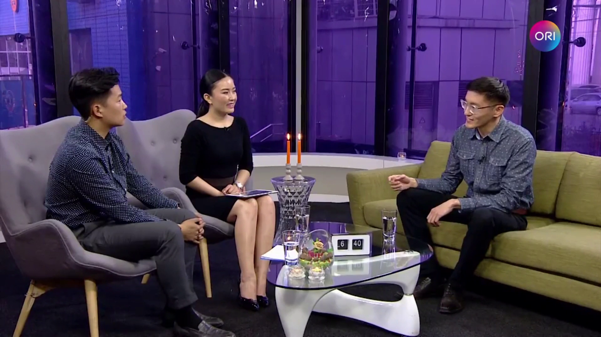

Last spring, I got a message request from someone who works at [Mongol HD TV](https://www.facebook.com/mongoltv/). She asked me whether if I'm available for an interview on the next week. It took me by surprise. Who would've thought a single [blog post](https://zolbayar.com/ugluunii-hun-ogloonii-hun-boloh-69a4a6894843) would get you an interview on the nation's highest-rated TV.

I accepted that offer instantly and then she sent me a sheet with questions which I correctly guessed as questions that are gonna be asked on my interview. She told me "write your answers as detailed as possible". Which made me wonder whether that could be an effective way to create quick notes for the hosts.

The TV show I invited to is a nighttime talk-show called "To and Fro". It was kind of ironic because I mostly talked about my morning rituals and other self-improvement techniques.

Me with the hosts. www.ori.mn

I went there at 5 pm and waited for half an hour in a lobby until the woman that contacted me came out to bring me in. The studio was bigger than I expected. But only a few members of the camera crew were there.

_My previous experience with a TV studio was an entirely different situation. Our company was running a nationwide marketing campaign with lottery. I developed the lottery program that looks like slot machine and essentially generates sequences of numbers randomly at a given time. The deadline was so tight, I finished the code only few minutes before the shoot began. At that time, I was standing behind the cameras._

The interview began and the hosts asked me the questions they've given me beforehand. I talked about how I became a morning person and how it changed my personal and professional life.

The interview lasted shorter than I expected (15 minutes). I was really nervous, you can [see](https://www.ori.mn/details/_5787939602001) my chest was pounding like crazy. When I just starting to get comfortable, the time was up and it ended. I felt somewhat disappointed after that because there were so much to talk about. Though, I hope someday I'll visit them again :)