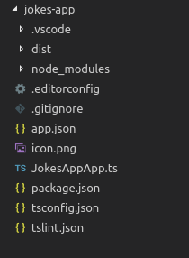
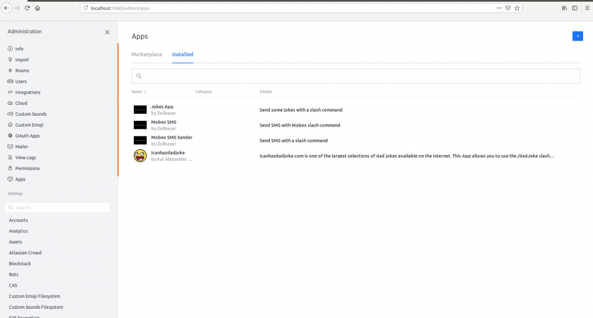
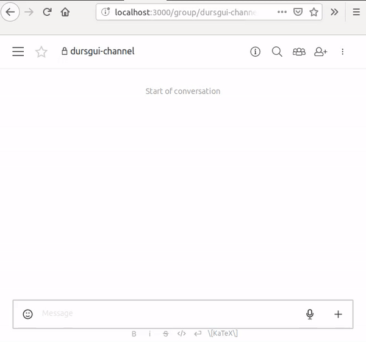

  
_Image courtesy of [Rocket.Chat](https://rocket.chat)_

I think most software developers just love step by step tutorials, detailed documentations and examples. These things help us to make sense of complex programming concepts without much of a mental overhead.

Some good examples of such easy-to-understand documentations I came across are [MDN web docs](https://developer.mozilla.org/en-US/docs/Web/JavaScript/Reference/Global_Objects/Array/reduce), [MongoDB Manual](https://docs.mongodb.com/manual/reference/operator/aggregation/max/#grp._S_max) and [Stripe API Reference](https://stripe.com/docs/api). And as you might've noticed, the Rocket.Chat Docs is not one of them. Their documentations are getting better, but I couldn't find any useful step by step guide on Rocket.Chat App development. So here's my take on it.

### How to develop a Rocket.Chat App?

My development environment (yours might be different from it):

*   OS - Ubuntu 18.04
*   Rocket.Chat - v0.74 (I think the v1 is bit too unstable for now)
*   npm - v3.5.2

Now let's start developing an app with a slash command. Which will send a random Chuck Norris joke every time you use it.

**1)** Install Rocket.Chat Apps CLI with the following command:

 ` `npm install -g @rocket.chat/apps-cli` ` 

**2)** Create an app scaffolding:

 ` `rc-apps create` ` 

**3)** If the above command went successfully. The terminal will show the following questions. Answer them.


```
Let's get started creating your app.
We need some information first:

   App Name: Jokes App
   App Description: Send some jokes with a slash command
   Author's Name: Zolbayar
   Author's Home Page: https://log.zolbayar.com/
   Author's Support Page: https://log.zolbayar.com/me/
```


**4)** The above command will create a Rocket.Chat app scaffolding inside  `jokes-app`  directory



A blank Rocket.Chat app structure

**5)** Now you can deploy the blank app into your Rocket.Chat instance. Please don't forget to go into the newly created app folder before running the command. And change the URL, username and password with your credentials.

_Update 2019/06/06_

_You have to set_  `_Enable development mode_`  _to_  `_True_`  _on Admin -> General before this command. Or you'll get the following error:_  `_Error: Deployment error: Direct installation of an App is disabled_` 


```
cd jokes-app

rc-apps deploy --url http://localhost:3000 --username user_username --password user_password
```


**6)** Go to your Rocket.Chat instance. Open Administration → Apps → Installed. Voila, then you'll see the app you've just created.



Installed apps on Rocket.Chat

**7)** Now you can activate the app. But because we're using Rocket.Chat v0.74, that's not possible. So we'll activate it through an API call

 ` `curl -H "X-Auth-Token: <YOUR_AUTH_TOKEN>" -H "X-User-Id: <YOUR_USER_ID>" -H "Content-type: application/json" http://localhost:3000/api/apps/<THE_NEW_APP_ID>/status -d '{"status":"manually_enabled"}'` ` 

Please don't forget to provide your own authentication token, user id and app id.

*    `<YOUR_AUTH_TOKEN>` ,  `<YOUR_USER_ID>`  - Click on your profile picture → My account → Personal Access Tokens → Add
*    `<THE_NEW_APP_ID>`  - Click on your newly created app. The URL will be something like this:  `http://localhost:3000/admin/apps/**f73383c5-3ee9-461a-acc1-fa27e8e18e0c**` . That last part in bold is your app ID.

**8)** Check the app log from MongoDB

 ` `db.rocketchat_apps_logs.find({appId: <THE_NEW_APP_ID>}).pretty()` ` 

Since you can't see the log in v0.74, this will be only way to see it.

**9)** If everything is fine up until here, we're gonna start developing the slash command now. Create a directory called  `commands`  on your project root (the app scaffolding). Then create a file  `SendJokeCommand.ts`  inside of it.

```js
import { IHttp, IModify, IPersistence, IRead } from '@rocket.chat/apps-engine/definition/accessors';
import {
    ISlashCommand,
    SlashCommandContext,
} from '@rocket.chat/apps-engine/definition/slashcommands';
import { JokesApp } from '../JokesApp';

export class SendJokesCommand implements ISlashCommand {
    public command = 'joke';
    public i18nParamsExample = 'SendJoke_Command_Example';
    public i18nDescription = 'SendJoke_Command_Description';
    public providesPreview = false;

    constructor(private readonly app: JokesApp) { }

    public async executor(context: SlashCommandContext, read: IRead, modify: IModify, http: IHttp): Promise<void> {
        const args = context.getArguments();
    }
}
```


The abovo code is doing the following things:

*   Importing relevant interfaces and classes from the rocket.chat package.
*   Importing main App class (JokesApp)
*   Defining command text, example and description.
*   Defining executor method which will run when the user writes  `/joke`  on chat

 `context.getArguments()`  will give you the user arguments. For example, if you write  `/joke hey Zolo` , the args variable will be  `['hey', 'Zolo']` . You can see it in action by logging the  `args` .

**10)** You need to provide the example and description strings in  `i18n`  directory. Create a directory named  `i18n`  in your project root and add  `en.json`  file inside of that.


```js
{
    "SendJoke_Command_Example": "Just send it",
    "SendJoke_Command_Description": "Send a random Chuck Norris joke with this command"
}
```


11) And change the  `JokesApp`  class to include the slash command to our app

```js
export class JokesApp extends App {
    protected async extendConfiguration(configuration: IConfigurationExtend, environmentRead: IEnvironmentRead): Promise<void> {
        await configuration.slashCommands.provideSlashCommand(new SendJokesCommand(this));
    }
}
[/code]
```


**12)** Now you can update your app and see the  `joke`  slash command by starting write  `/j` . In order to update your deployed app, run the following command:

 ` `rc-apps deploy --url http://localhost:3000 --username user_username --password user_password --update` ` 

**13)** If you see your command from the slash commands list, let's start doing the fun part. Call Chuck Norris jokes API to fetch random jokes. In order to do that, we're gonna change the  `executor`  method a bit.

```js
public async executor(context: SlashCommandContext, read: IRead, modify: IModify, http: IHttp): Promise<void> {
        const message = await modify.getCreator().startMessage();
        const sender = await read.getUserReader().getByUsername(context.getSender().username);

        const room = await read.getRoomReader().getById(context.getRoom().id);
        const roomEph = context.getRoom();

        if (!room) {
            throw Error('No room is configured for the message');
        }

        message.setSender(sender);

        try {
            const result = await http.get(`http://api.icndb.com/jokes/random`);
            if (result.data.type === 'success') {
                const joke = result.data.value.joke.replace(/"/g, '"');
                message
                    .setRoom(room)
                    .setText(joke);
                modify.getCreator().finish(message);
            } else {
                throw new Error('Could not get the joke');
            }
        } catch (error) {
            message
                .setRoom(roomEph)
                .setText(error.message);
            modify.getNotifier().notifyRoom(roomEph, message.getMessage());
        }
    }
```

Our goal here is to build a message and send it as you're sending a message.

*   Create a blank message variable with  `modify.getCreator().startMessage()` 
*   Get a sender which is you in this case. But it seems you can get any user or bot by its id. For example, you can send the message as the Rocket Cat bot by getting it with the following command:  `read.getUserReader().getById('rocket.cat')` 
*   Call the jokes API and set message text as its value.
*   Set the sender, room to the message
*   If there is any error, show an ephemeral message only to you with  `modify.getNotifier().notifyRoom()` 
*   If everything went OK, send the message with  `modify.getCreator().finish(message)` 

Now you can update your app and send some joke to anyone :D



Really simple app in Rocket.Chat

### What now?

Of course it was a really simple app. You can create a whole more complex apps on Rocket.Chat. So here are some additional resources to get you started:

*   [Source code of the jokes-app](https://github.com/zolbayars/Rocket-Chat-Jokes-App ) - Maybe use it to bootstrap your Rocket.Chat App project
*   [Rocket.Chat Apps TypeScript Definition](https://rocketchat.github.io/Rocket.Chat.Apps-engine/globals.html) - Where you can find the documentations about the class and interfaces used above. Such as  `IModify` ,  `IRead` , etc.
*   [Giphy.com Rocket.Chat App source code](https://github.com/wreiske/Rocket.Chat.App-Giphy) - Learn how to use other complicated features in Rocket.Chat App development

If you have any question, leave a comment :)