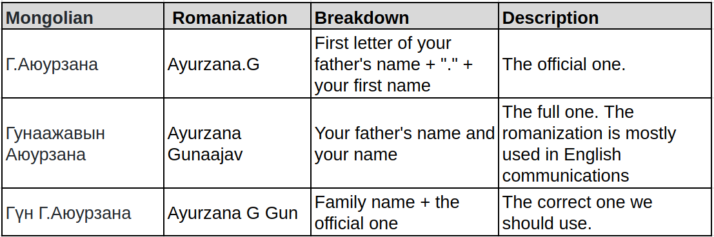

_**From an average guy’s perspective**_

_Please note, this series is solely based on my experience as a young man living in Mongolia. If you want to read official and more sophisticated content about Mongolia, please head to the _[_UB Post_](https://theubposts.com/)_, _[_GoGo Mongolia_](http://mongolia.gogo.mn/)_ or _[_MONTSAME._](https://montsame.mn/en/)

Naming tradition in Mongolia is quite different than its neighbors and western countries. When you see names like Christopher Nolan and Jonathan Nolan, you might wonder if they are somewhat related or not. But when you see names like O.Bat-Ulzii and B.Tamir, you have no idea that they are actually a father and son.

## The naming "convention"

Here I chose the famous Mongolian writer [Ayurzana.G](http://ayurzana.mn/)'s name to show different styles of written names in Mongolia:

## What happened to our surnames?

Most of us adapted ["Borjigon"](https://en.wikipedia.org/wiki/Borjigin) as our family name after the democratic revolution much like many Koreans adapted prestigious ["Kim"](https://en.wikipedia.org/wiki/Kim_(Korean_surname)) as their surname during the Japanese occupation. Though lost all of its _mojos_ now, "Khiad Borjigon" was a royal family name of the Genghis Khan..

Sadly, we don't use our family names as much as I would like. Everyone would call you by your first name, even when they were complete strangers. But the family members and close acquaintances would call each other by their nicknames or shortened names. For example, my friends call me _Zolo_ which is one of the most common short name among both sexes.

People would call you by your full name like _Zolbayar Bayarsaikhan_ only in official situations. And your close friends or family might call you like that if you piss them off enough.

## The Most Common Names in Mongolia

As you might know, Tibetan names such as _Luvsan_, _Dolgor_, _Baldan_, _Dorj_, _Dulmaa_ or _Dash_ were really common among us due to the influence of Tibetan Buddhism.

When a new child is born, the father would go to a lama (teacher of the Dharma) to name his newborn child. The lama would ask him about the time of day the child was born and the parents' zodiac signs to calculate an appropriate name "combination". The result would be some "_Luvsandorj_" for a boy or "_Dulamsuren_" for a girl. It was a regular practice in the old days and even now it's not uncommon.

During the communist regime, that practice declined steeply due to lack of lamas to ask around (most of them were shot dead during the great purges of the 1930s) and the increasing impact of the Russian socioeconomic and cultural wave in Mongolia. Then came the names like _Mikhail_, _Alexander,_ and _Octyabr_, though it was somewhat rare.

Now, here is a list of the 10 most common names in Mongolia:

1.  **Бат-Эрдэнэ** (Bat-Erdene):
    *   _Bat - strong, firm; Erdene - treasure or precious thing._
    *   As I read in somewhere, there were only two people with this name in the 60s. Grew in popularity due to the wrestling champion (now MP) [Bat-Erdene Badmaanyambuu](https://mn.wikipedia.org/wiki/%D0%91%D0%B0%D0%B4%D0%BC%D0%B0%D0%B0%D0%BD%D1%8F%D0%BC%D0%B1%D1%83%D1%83%D0%B3%D0%B8%D0%B9%D0%BD_%D0%91%D0%B0%D1%82-%D0%AD%D1%80%D0%B4%D1%8D%D0%BD%D1%8D)
2.  **Хулан** (Khulan):
    *   _Khulan - The archaic meaning was some kind of beige color ideal for a woman's face. Now, a wild ass (no pun intended)._
    *   Might be popular because of its length (we think it's good to call someone always by his/her full first name) and the fact that one of the queens of the Genghis Khan was named Khulan.
3.  **Тэмүүлэн** (Temuulen):
    *   _Temuul - Try to achieve; Temuulen - Genghis Khan's daughter's name_
    *   A unisex name with historical context and some positive vibe.
4.  **Номин-Эрдэнэ** (Nomin-Erdene):
    *   _Nomin-Erdene - azurite (one of the "nine treasures" of Mongolia)_
    *   Another unisex name with a good vibe and some possible symbolism for a wealthy life.
5.  **Билгүүн** (BIlguun):
    *   _Bilguun - wise and enlightened_
    *   Just a cool name for a boy
6.  **Отгонбаяр** (Otgonbayar):
    *   _Otgon - the youngest one or the little on; bayar - joy, holiday or festivity_
    *   A typical name for the youngest male child. Its female counterpart would be _Otgonjargal_
7.  **Мөнх-Эрдэнэ** (Munkh-Erdene):
    *   _Munkh - eternal; erdene - treasure or precious thing_
    *   Symbolizes well being and longevity
8.  **Төгөлдөр** (Tuguldur):
    *   _Tuguldur - complete, perfect_
    *   Symbolizes a beautiful, perfect life without any bullshit. It's one of the names that never gets old.
9.  **Энхжин** (Enkhjin):
    *   _Enkhjin - An eternal peace or Yāma (the peaceful heaven)_
    *   Symbolizes well being and peace
10. **Дөлгөөн** (Dulguun):
    *   _Dulguun - Calm and peaceful_
    *   A unisex name trended after the democratic revolution

## "Crazy" Names

Someday, you might stumble upon someone named _Muunokhoi_ ("Bad dog"), _Khunbish_ ("Not a human") or _Enebish_ ("Not this one"). It's not because that person's parents hated him/her. The reason is quite the opposite.

Parents would give their newborn child a name like "Bad Dog" after losing their previous infant child due to fatal illness or other conditions. It's a common belief that the names like this deceive the evil force or the devil who took their previous child. Thus protecting the newborn by actually transforming his/her identity into something the devil wouldn't care.

## Naming Taboo

It's considered taboo to call someone by his/her real name if he/she has the same name as your parents. Instead, you would try to call them with their nickname or use a personal pronoun. One practice common in central Mongolia is to use the name "Nert" which literally means "One with the name", though I've never heard anyone using it in UB.

## Latest Trends in Baby Names

Since the 2000s, the baby names are becoming shorter and shorter. One of the major factors of this change is an ongoing belief in calling someone's name "completely" has a positive effect on his/her well being. For example, when your name is _Narangerel_, most people would call you with a short version of it: "_Naraa_". But when your name is _Bat_ or _Gegee_, people wouldn't have a chance to shorten it any more. So they will call you by your actual name. I don't know where it's originated, but people seem to buy it.

As I mentioned before, Tibetan names were commonplace among Mongolians even after the revolution of 1921. The revolution ushered a new era of industrialization, civilized cities and new kinds of names. "Pure" Mongolian name combinations and Russian names were becoming trendy. Such names are _Enkhbayar_, _Batbold_, _Narangerel_. I put the pure in double a quote, because there are not many things that are really pure. If you dig deep, these names might have some Turkic or Sanskrit origin.

_If you have any question, please leave a comment._
