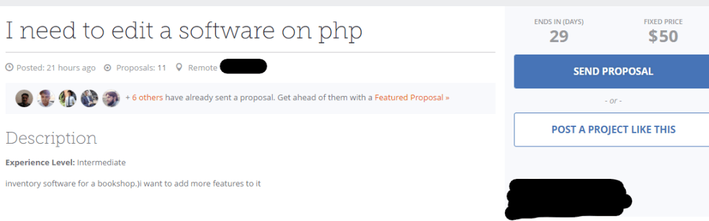
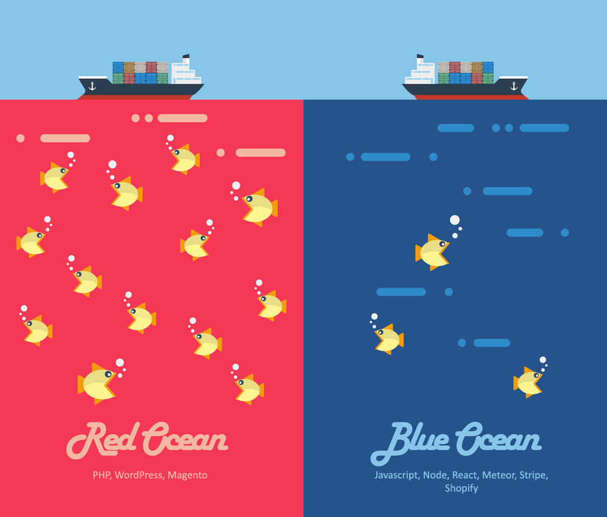
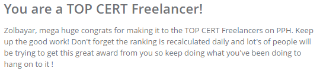

I've just become a [Top Cert Freelancer](https://www.peopleperhour.com/freelancer/development-it/zolbayar-bayarsaikhan-software-developer-yqmmmvx) on [PeoplePerHour](https://www.peopleperhour.com/). Here's what I did as a software developer to get there in 4 simple steps. But most of it can be applied to another field too.

## 1\. Stay Away from Toxic Clients

Don't work for someone who doesn't even respect the platform. Such clients create projects like this:

An example of a client who doesn't respect the platform and the freelancers

What's wrong with it?

1.  Vague description - Not really sure what I'm getting into.
2.  Slipshod writing / lousy requirement - Comprehensible, but no sentence structure at all.
3.  No way to estimate the amount of work required - Do you know exactly how many hours is it gonna take to "_add more features_" to a bookshop inventory system written in PHP? That's somewhere between 1 to ∞.
4.  Extremely low fixed price - Even it had a fantastic description and a full system requirement written with technical proficiency, this one is a massive red flag. The buyer should've entered the "per hour" price, though he doesn't really care. Or he's just trying to outright hustle freelancers.

You might've noticed that there are 11 freelancers who sent proposals to this low quality "project". One of them is certainly gonna be accepted. And I wonder what would happen if the buyer demands 3 days of work for that 50 bucks. Raise a dispute? That'll hurt **your** ranking and status. Refuse to do the works? Gonna hurt **your** ranking and status. So don't be a sucker for this kind of "project". Look for a good client and only send proposals to a project that interests you. Defend your ranking! With these in mind, you're halfway through the TOP CERT.

## 2\. Find Your Niche

Freelancing websites are packed with WordPress/PHP developers. And the PeoplePerHour is no exception. These technologies have been around for 15+ years. There are hundreds if not thousands of WordPress developers competing for a job. Most of them have been doing this for 4+ years while gathering enormous experience, customer feedback, and portfolio to show off.

So how are you gonna compete with them?

Well, you shouldn't.

It's just a waste of time. Swim away from the mainstream to a less crowded area where you can thrive on small, yet fun projects. Find your niche.

Let's swim in the Blue Ocean

Wanna become an expert in a single programming language? That's too broad. Narrow it down beyond frameworks, straight to the platforms such as [Stripe](https://stripe.com/gb), [Shopify](https://shopify.com/), or [RocketChat](https://rocket.chat/). Choose one and try to learn everything about it. After a while, you'll become one of a few people who knows in and out of that certain platform.

## 3\. Be a Good Communicator

Don't be a jerk.

Nobody wants to work with a highly skilled jerk. So having a polite manner and good communication skill is the defining factor of your freelancing success.

Being nice with people doesn't require much from you. Yet, it has tremendous benefits for you and your business.

Text communications can be a little dry at some time. A simple sentence you've written might come out as rude or unemotional. So smooth things up with a little bit of emoji.

Same messages with different vibes

## 4\. Realign your vision

Only chasing money will make you a hustler. And people don't build a profitable/long-lasting relationship with hustlers. So align your vision/goal with your client's vision. See beyond the thin layer of money he/she is offering.

Be a compassionate person. Try to put yourself in your client's shoes. Try to make things work, not because of the money, but because you care about your client's work. See your fee as a bonus. Your goal should be the positive impact you're creating.

* * *

With these things in mind, you'll certainly gonna make it to the top and beyond. Keep it up!

