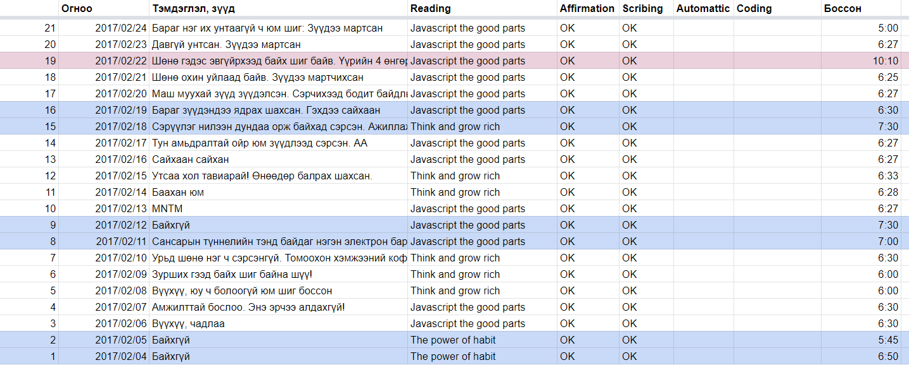
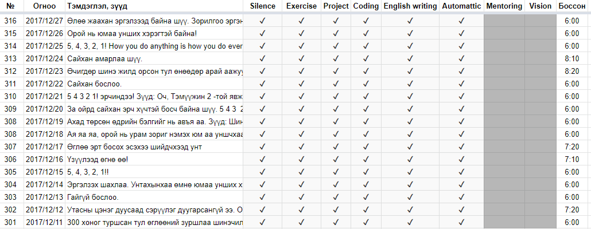
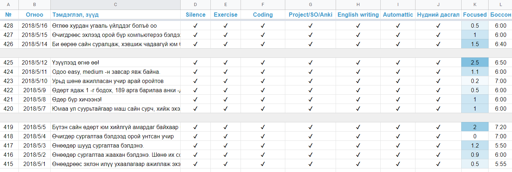
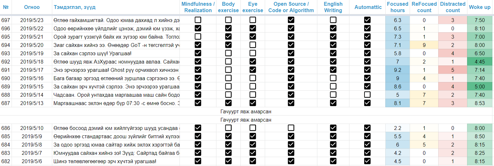
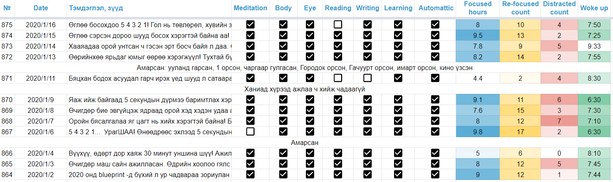

Remote work is a game of **focus**. You have to focus in order to survive.

Being able to focus intensely on your craft might be the single most important skill that you have to master. It will decide your fate as a remote worker because you have nothing but your sheer productivity to keep your job. So keep in mind that the productivity is a fruit of deep focus.

I'd like to tell you "_You must learn to focus in under any circumstances_". But, heck, that's a bullshit advice. Instead, you have to measure your focus in daily basis and try to find the optimal relation between your daily rituals/habits and productivity.

So, here I'd like to share my productivity sheets from 2017 to this day.

## Version 0

Just when I got started. It contains the date, short note or a dream diary, title of the book that I read in the morning,

The blueish highlights are denoting the weekends. I indulged myself to sleep one more hour during that time. The reddish highlights are for the days when I couldn't wake up at the time, such as when I was sick or traveled.

The main focus of my morning routine was to read technical or self-improvement books.

## Version 1

Then, after 300 days, I revised the sheet to include much more things to my morning routine. Here are the changes:

*   Meditation/Mindfulness added as "Silence" column. I've been trying to meditate every day since then.
*   Exercise - Short amount of calisthenics to keep the blood flowing. But as I look back now, the duration was little bit too short (< 5 mins).
*   English writing is added, since my goal was to work remotely. Having at least upper-intermediate proficiency in written English is of the utmost importance.

Some notable inclusions are: silence (5-minute meditation), exercise (simple push ups), side-project and English writing

My main focus at that time was to improve my dev skills and start an open source side-project. But, boy! I failed them miserably. The reason was that I could only chisel out some 0.5 → 2 hours for me in the morning before heading out to my full-time job. I was usually too tired to do anything when I came home after work. And I preferred to spend time some quality time with family during the nights.

## Version 2

After 100 or more days with the v.1, I started to include the most important column: the number of hours I focused and worked on my list that day. Since then, keeping that number high became my only daily goal. _You see the pattern?_

Google Sheet's conditional formatting feature is cool!

## Version 3

Then again, after using the version 3 for more than 100 days, I decided to rip away some of the tasks and added more cool numbers to track:

*   ReFocused count - The number of times that I was almost going to get distracted and do useless things, but refrained from them. Thus gaining a "re-focus".
*   Distracted count - The number of times that I actually got distracted and sucked into great abyss of the internet!

Started to highlight the time I woke up. Earlier I wake up, greener the cell will be.

The previous version contained too many things to check-off for a single day. Which was spreading my focus thin. So I've removed some of them here.

## Version 4

The current version that I'm using as of Feb 2020. I've made it more clean and succinct by removing the "Open Source / Code or Algorithm" section since I'm coding everyday anyway.

I think I'm gonna stick to this version at least for entire 2020

I'm thinking about revising my productivity sheet every year to adapt to that year's main goal of mine.

* * *

I strongly urge you to create and use same kind of productivity sheet. It's incredibly useful for seeing the unique patterns that no other system could tell you.

_Feel free to leave a comment if you have any questions/suggestions_ 😊